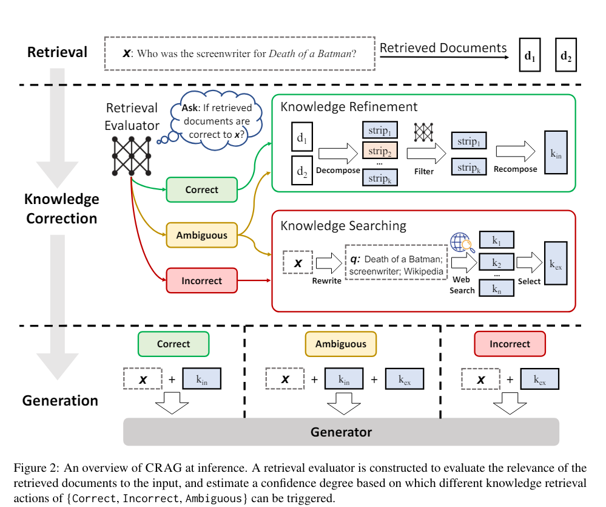

# Corrective Retrieval Augmented Generation (CRAG)

CRAG is a method designed to enhance the robustness of text generation by addressing the limitations of large language models (LLMs) and retrieval-augmented generation (RAG) systems.

## 👉 Key Takeaways of CRAG:

- Addressing Hallucinations in LLMs: 
LLMs can generate inaccurate texts because they rely solely on their internal parametric knowledge, which can be flawed or incomplete. CRAG aims to mitigate this issue.
 
- Improving Retrieval-Aided Generation:
While RAG systems supplement LLMs by retrieving external documents to improve accuracy, their effectiveness depends on the relevance of these documents. CRAG enhances this process by ensuring better handling of retrieved content.

- Lightweight Retrieval Evaluator:
CRAG introduces a lightweight retrieval evaluator that assesses the quality of retrieved documents for a given query. It assigns a confidence degree, triggering different knowledge retrieval actions (correct, incorrect, ambiguous) based on the evaluated relevance.

- Use of Large-Scale Web Searches:
To overcome the limitations of static and limited corpora, CRAG incorporates large-scale web searches. This approach expands the scope of retrieval to include more diverse and potentially relevant documents.

- Decompose-Then-Recompose Algorithm:
This algorithm selectively focuses on the key information within retrieved documents while filtering out irrelevant parts. This ensures that only the most pertinent information is utilized.

- Plug-and-Play Compatibility:
CRAG is designed to be easily integrated with various RAG-based approaches, enhancing their performance without requiring extensive modifications.

## 👉 Results

CRAG has been tested on four datasets, covering both short- and long-form generation tasks.

The experiments demonstrate that CRAG significantly improves the performance of RAG-based approaches, showcasing its effectiveness in enhancing the robustness and accuracy of generated texts.

## 👉 Overall:

CRAG represents a significant advancement in the field of text generation by combining corrective mechanisms with advanced retrieval and refinement strategies to produce more accurate and reliable outputs.

- Paper: https://lnkd.in/e2MA9qHY
- Code github: https://lnkd.in/e5wCr7Ti
