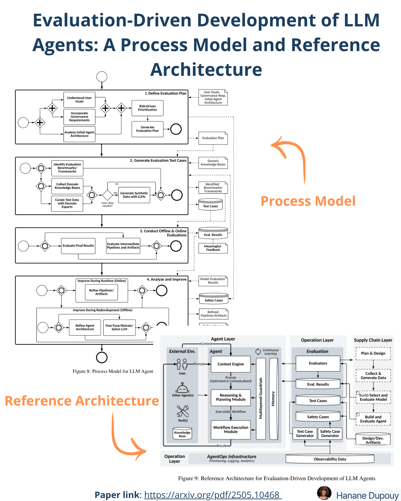

# Evaluation-Driven Development of LLM Agents: A Process Model and Reference Architecture

Evaluating AI agents is critical to ensure their performance and safety—especially given their dynamic, autonomous, and evolving nature.
But traditional methods like predefined test cases or static pipelines fall short when dealing with the unique challenges of LLM agents.

Paper link: https://arxiv.org/abs/2411.13768

Why?
Because AI agents are autonomous systems that reason, plan, and interact with external elements—APIs, knowledge bases, other agents, memory—making evaluation much more complex.

To address this, the authors propose a new Evaluation-Driven Development approach, inspired by TDD and BDD.

This approach aims to bridge a key gap in current research:
- Model-level evaluation (response coherence, factual accuracy)
- System-level evaluation (tool use, workflows, adaptation to real-world contexts)

It also introduces adaptive evaluation: embedding feedback across the agent’s lifecycle to enable continuous monitoring and improvement.

How?
By introducing:
A/ A Process Model
B/ A Reference Architecture

## A – Process Model
The model combines offline + online evaluations and structured feedback loops to enable continuous refinement of LLM agents.

It’s built in 4 key steps:
### 1. Define Evaluation Plan
Establish a dynamic, risk-aware evaluation plan that adapts over the agent’s lifecycle.

How?:
- Understand user needs and goals.
- Integrate legal, ethical, and regulatory requirements.
- Analyze agent architecture to identify vulnerabilities.
- Prioritize risks based on severity and domain sensitivity.
- Generate a structured evaluation plan that combines objectives, criteria, and methodologies.

### 2. Develop Evaluation Test Cases
Translate the evaluation plan into actionable, adaptive test cases.

How?:
- Select benchmarks and frameworks (e.g., AgentBench, DeepEval).
- Collect domain-specific knowledge.
- Curate real-world test data with experts.
- Generate synthetic test data using LLMs to simulate edge cases.
Output: A comprehensive test suite for standard and high-risk scenarios.

### 3. Conduct Offline & Online Evaluations
Implement evaluations in both controlled (offline) and real-world (online) environments.

How?
- Offline: Validate core functionalities using predefined test cases.
- Online: Continuously monitor agent performance, behaviors, and user interactions.

Focus:
- Assess final results (e.g., task success, accuracy).
- Inspect intermediate artifacts (e.g., prompts, tool outputs).
- Use both AI and human evaluators for reliability and interpretability.

### 4. Analyze and Improve
Turn evaluation results into actionable improvements.

Runtime (Online):
- Adjust workflows, tools, and prompts in response to live feedback.
- Use mechanisms like anomaly detection or user corrections.

Redevelopment (Offline):
- Refine agent architecture and guardrails.
- Fine-tune, retrain, or replace the LLM when necessary.

Outputs: Updated safety cases, refined architecture, improved LLM and pipelines/artifacts.

## B- Reference Architecture:
Goal: Present a reference architecture that structurally embeds evaluation as a continuous and adaptive driver throughout the lifecycle of LLM agents—ensuring real-time monitoring, feedback integration, and iterative improvement.

This architecture is composed of 3 layers:

### 1. Supply Chain Layer
Purpose: Prepares the foundation for agent design and evaluation.

Key Functions:
- Define user goals, governance requirements, and architecture.
- Collect and preprocess data. Prepare evaluation data for LLMs.
- Build and validate the integrated system via offline evaluation.
- Generate and store test cases, safety cases, and evaluation results.

### 2. Agent Layer
Purpose: Executes agent reasoning, planning, and interaction with the environment.

Key Components:
- External entities: users, tools, other agents, knowledge bases, context engine, reasoning/planning, execution workflows, memory, guardrails.
- Integrates evaluation feedback to adapt behavior dynamically.

### 3. Operation Layer
Purpose: Enables continuous evaluation and adaptation.

Key Elements:
- Evaluation Engine: Runs real-time and offline assessments using AI and human evaluators.
- AgentOps Infrastructure: Monitors system behavior, detects anomalies, and routes feedback into improvement pipelines.
- Outcome: Drives both immediate runtime adjustments and long-term system refinements.
