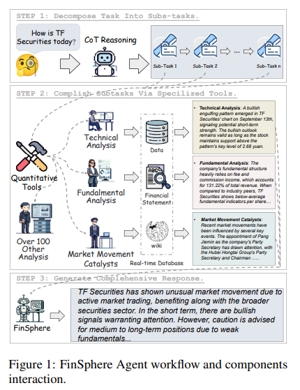

# FinSphere: A Conversational Stock Analysis Agent Equipped with Quantitative Tools based on Real-Time Database

The authors of this paper describe:
## 1) FinSphere 
FinSphere: an AI agent that can generate high-quality stock analysis reports in response to user queries:

FinShpere is integrated with real-time financial database which includes various market stocks data including both structured data (price movements, trading volumes, financial metrics) and unstructured data (corporate, announcements, analyst reports, market news).

### Workflow
The agent goes through 3 steps:
1- It decompose a user query into a CoT sequence (sub-tasks), and identifies the appropriate quantitative tools required for each component.
2- Each sub-task is then given to a set of quantitative tools: Technical analysis, Fundamental analysis, Market movement catalysts...Those tools are connected to real-time databases to extract information and perform specialized calculations. 
3- Then the agent will provide the final answer. 

### Instruct-tuning:
The authors finetuned Qwen2-72B using LoRa (Low-Rank Adaptation) and the Stocksis dataset (cf below).

Alongside FinSphere, the others describe 2 other contributions:

## 2)Stocksis: 
A specialized dataset curated by industry experts to enhance LLMs’ stock analysis capabilities.
This dataset is comprised of 5000 pairs of (inputs, labels) specialized in financial analysis related topics:
- Input : A prompt including and aggregating outputs coming from various quantitative analysis tool.
- Label: Comprehensive analytical answer that addresses the prompt's requirements while effectively leveraging background information.
(only 50 pairs are open source)

## 3) AnalyScore:
An evaluation framework for assessing stock analysis quality. It combines both qualitative standards and quantitative metrics to provide a comprehensive assessment of report quality. 
"Currently, AnalyScore is employed solely by human experts in stock analysis, but we plan to design detailed prompts that enable LLMs to replace human experts in evaluating analysis reports using AnalyScore in the future.

Paper: https://arxiv.org/pdf/2501.12399
