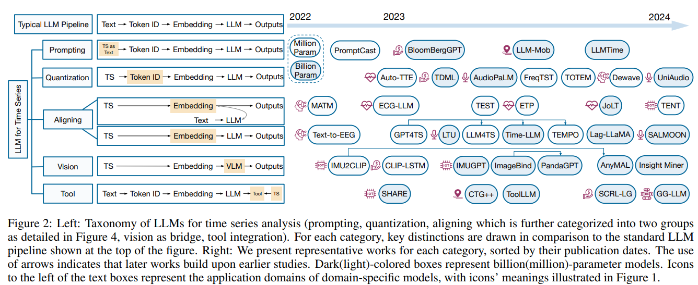

# LLMs for Time Series: A survey

The authors discusse the potential of Large Language Models (LLMs) for analyzing time series data across various domains such as climate, IoT, healthcare, and finance. It highlights the gap between LLMs, originally designed for text data, and the numerical nature of time series data. 

The paper provides a taxonomy of methods to adapt LLMs for time series analysis, including direct prompting, time series quantization, and using vision models as a bridge. 

It also reviews datasets that combine time series and text, addressing challenges and future research directions in this emerging field.

Traditional methods for time series analysis, like frequency analysis and deep learning approaches (e.g., CNNs, LSTMs, Transformers), have been widely used. However, the advent of Large Language Models (LLMs) has revolutionized areas like natural language processing (NLP) and computer vision (CV). Inspired by this success, researchers are now exploring LLMs for time series analysis. 
The challenge lies in adapting LLMs, which are designed for discrete text data, to the continuous, numerical nature of time series data.

Paper link: https://arxiv.org/pdf/2402.01801

## Key Challenges of LLMs in Time Series Analysis:

- Modality Gap: LLMs are trained on discrete textual data, whereas time series data is continuous and numerical. Bridging this gap is a significant challenge.
- Continuity and Auto-Regressiveness: Time series data has properties like continuity and auto-regressiveness, which differ from the static nature of text data.
- Sampling Rate Dependency: Time series data relies heavily on the sampling rate, adding complexity in adapting LLMs for such tasks.
Cross-Domain Knowledge Transfer: Effectively transferring knowledge from LLMs, which excel in language-based tasks, to time series analysis is a challenging frontier.

## Approaches to address the challenges:
The taxonomy in the paper proposes several approaches to address the challenges of using LLMs for time series analysis. Here’s a summary of these methods:

- Prompting: This approach treats time series data as text, using direct prompts to utilize pre-trained LLMs. It is easy to implement but may lose the semantics tied to numerical data, especially for high precision or multivariate time series. This method is useful for zero-shot tasks but may not be efficient for long-term predictions.

- Time Series Quantization: This method discretizes continuous time series data into tokens. By turning continuous data into discrete tokens, the model can process it more effectively, though this may require a two-stage training process. (Techniques like Vector Quantized-Variational AutoEncoder (VQ-VAE) or K-means clustering are used).

- Aligning: In this method, a time series encoder is designed to align time series embeddings with language embeddings, using techniques such as contrastive learning. There are two types of alignment: similarity matching, which aligns embeddings through loss functions, and LLM-backbone methods, where time series data is processed through a large language model with additional fine-tuning.

- Vision as a Bridge: This approach leverages visual representations of time series data, transforming the data into a visual format such as graphs or images, which are then processed using vision-language models. This helps bridge the gap between continuous numerical data and LLMs by using existing knowledge from vision models.

- Tool Integration: Instead of directly processing time series data, this approach uses LLMs to generate tools, such as code or API calls, to assist in time series-related tasks. For example, an LLM could be used to generate a traffic forecasting tool by creating code from textual descriptions.

## Multimodal datasets:

Authors also cited various available multimodal time series and text datasets that help applying LLMs for time series.
There are different datasets that can be applied to different domains:

- IoT (Internet of Things): Datasets like Ego4D and DeepSQA are used for tasks like human activity recognition by pairing time series data from devices (such as IMU sensors) with textual descriptions.

- Finance (FOCUS): PIXIU presents multi-task and multi-modal instruction tuning data in the financial domain with 136K data samples. It contains both financial natural language understanding and prediction tasks, and covers 9 datasets of multiple modalities such as text and time series. 
MoAT constructs multimodal datasets with textual information paired with time series for each timestep, such as news articles extracted with relevant keywords, mostly covering finance related domains such as fuel, metal, stock and bitcoin.

- Healthcare: Datasets such as Zuco and PTB-XL offer rich multimodal data, such as eye-tracking, EEG, and ECG measurements, paired with text for classification and question-answering tasks.

- Audio and Music: Datasets like AudioSet and MusicCaps pair audio data with textual descriptions to support tasks like music captioning, tagging, and classification.

