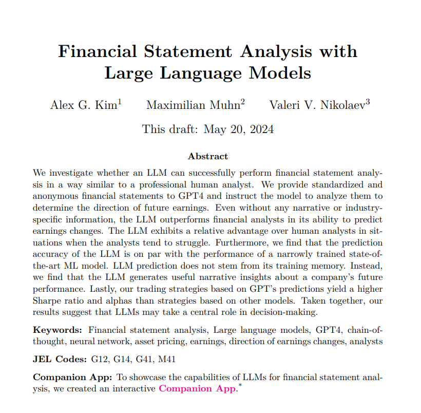

# Financial Statement Analysis with Large Language Models

The study aims to investigate if LLMs can effectively analyze financial statements and predict future earnings, comparing their performance to human analysts, SOTA ML models and assessing the implications for the future of financial analysis​.

## FSA
The paper highlights the importance of FSA (Financial Statement Analysis) for informed decision-making in financial markets: One of the most important goals of FSA is to predict a firm’s earnings, which serves both as input in stock market recommendations and an output that informs investors.

It also outlines the complexity of these kinds of analyses from a human perspective, as they require detailed and explicit work, including the calculation of financial ratios and a broad contextual understanding, which includes taking into account soft information, industry knowledge, regulatory, political, and macroeconomic factors—something that machines often cannot do.

## Target
The main target of the paper is to predict a binary change in future earnings: Increase or decrease.

## Dataset
The dataset was anonymized by removing the firm names and the years, preventing the LLM from recognizing the underlying knowledge (As it was pre-trained on a very large dataset that included historical financial data, among other information).

## Prompt Techniques
The authors used 2 different prompt’s techniques to evaluate the LLMs performance: 
Standard prompt: asking to calculate key financial ratios and determine the direction of the earnings forecast.
CoT prompt: This prompt was designed to reflect a financial analyst's reasoning, by providing ratios’ formulas, computation and insights based on these ratios.
   
There was no fine-tuning or pre-training.

## Evaluation and Results
The LLM evaluation was conducted against a naive model, financial analysts (providing forecasts at different time intervals after the financial statement releases), and ML models such as logistic regression and ANN.

GPT-4-Turbo shows an interesting performance when using CoT prompts, by achieving an accuracy of 60.31%, compared to analysts who performed at 53% one month after the earnings release.
Furthermore, GPT-4-Turbo’s performance is comparable to that of ANN (Artificial Neural Networks), which achieved 60.45%, and significantly higher than the stepwise logistic regression, which demonstrated an accuracy of 52.94%.

## Are LLMs going to replace Analysts?
Overall results show that GPT-4's predictions outperform those of human analysts, particularly when analysts exhibit biases or inefficiencies. 

The study finds that GPT-4's predictions are especially valuable when human analysts struggle, indicating that LLMs can complement human judgment in financial analysis. 

In the meantime, GPT-4 showed poor accuracy in analyzing smaller firms and those that recorded a loss, whereas the performance of the analyst was more impressive, highlighting the importance of the complementarity between LLMs and analysts in some cases.

## What about LLMs vs SOTA ML models?
The study also highlights the good accuracy of powerful LLMs compared to SOTA and specialized ML models like ANN.
 LLMs hold a significant advantage over ANNs because they are trained on an extensive body of general knowledge, covering numerous business cases, financial theories, and economic contexts. 
This expansive theoretical foundation enables LLMs to derive insights from unfamiliar data patterns, giving them an edge in the complex field of financial analysis.

## Where Does an LLM’s Predictive Ability Come From?
### Hypothesis 1
The LLM is using its memory and outperforming due to a look-ahead bias. This means it’s using its underlying knowledge (the pre-training data) to extract the right information for the prediction target.

However, as explained before, by anonymizing the datasets—removing firm names, representing years as relative terms like t and t-1, and standardizing the data format—any look-ahead bias in the LLM was eliminated.

However, is the LLM capable of guessing the name of the firm? The authors conducted a study showing that the LLM exhibits poor accuracy in guessing firm names, as it frequently guessed the biggest names like Facebook and Google, which were the most probable tokens.

### Hypothesis 2 (one of the important key takeaways)
The insights generated by the LLM, after computing financial ratios and using CoT prompts, serve as the foundational information (and act as inputs) for the LLM to infer the direction of future earnings.

This hypothesis was validated by the authors by extracting all these narratives generated by the LLM and encoding them into 768-dimensional embedded vectors using BERT to train an ANN.  This ANN achieved an accuracy of 59%, which was close to GPT's accuracy of 60%. This provides evidence that the narrative insights generated by the model are informative about future performance, as shown by a 94% correlation between GPT's forecasts and ANN forecasts.

Link to Paper: https://papers.ssrn.com/sol3/papers.cfm?abstract_id=4835311
