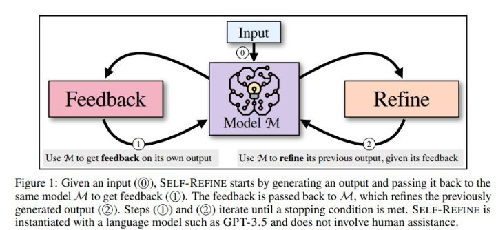
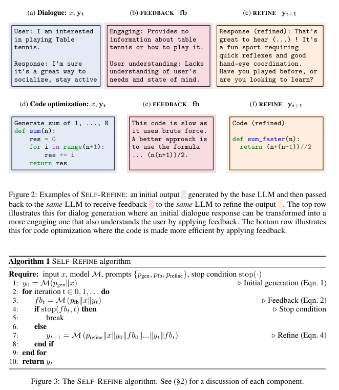

# Self-Refine: Iterative Refinement with Self-Feedback

SELF-REFINE is a method that improves outputs from LLMs through iterative feedback and refinement. Unlike previous methods requiring extensive supervision, SELF-REFINE uses a single LLM to generate initial outputs, provide feedback, and refine the output iteratively without additional training or data .

Self-refine algorithm alternates between two generative steps: FEEDBACK and REFINE.

Paper link: https://arxiv.org/abs/2303.17651

## 👉 SELF-REFINE Algorithm and Prompts Example :

## 👉 SELF-REFINE operates by :
1- Generating an initial output from an input sequence using a LLM, then 

2- Using the same model to generate a feedback on this output

3- Passing back the feedback to the same LLM to refine the output in a loop until a desired condition is met. 

This process does not require any additional training, relying instead on in-context learning .

## 👉 Evaluation
The effectiveness of SELF-REFINE is quantified using specific, task-related metrics and a human preference evaluation. Results show that SELF-REFINE consistently outperforms base models and previous state-of-the-art methods across various tasks, including code optimization, dialogue response generation, and math reasoning  .

Authors show that SELF-REFINE outperforms:

1- Direct generation from strong LLMs like GPT-3.5 (text-davinci-003 and gpt-3.5-turbo) and GPT-4 by 5-40% absolute improvement. (Paper from May 2023)

2- In code-generation tasks, SELF-REFINE improves the initial generation by up to absolute 13% when applied to strong code models such as Codex (code-davinci-002).

## 👉 Feedback and Refinement Process
SELF-REFINE's effectiveness largely depends on the quality of the feedback. The paper discusses the importance of specific, actionable feedback over generic feedback, showing how detailed feedback leads to significant improvements in the refined outputs .

## 👉 Comparative Analysis
A qualitative analysis highlights that most failures in refinement were due to inappropriate or inaccurate feedback rather than issues with the refinement step itself. Successful refinements typically followed precise and useful feedback .