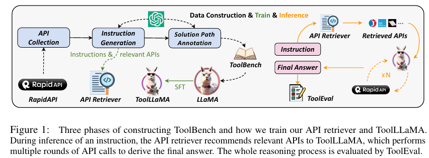

# ToolLLM
Discover what ToolLLM, an open-source framework, does!

👉 ToolLLM is a framework designed to enhance LLMs by improving their tool-use capabilities, specifically with APIs. 
It also aims to bridge the gap between open-source LLMs and SOTA proprietary models like ChatGPT/GPT-4 in the context of tool use.

Paper link: https://arxiv.org/abs/2307.16789

## 👉 ToolLLM key elements:

1. ToolBench: 
A dataset for training models to use APIs, constructed using ChatGPT.These APIs are sourced from RapidAPI hub, in which you can find multiple categories, from finance, to sports, music, food...
The dataset includes 16,464 real-world APIs across 49 categories, focusing on both single-tool and multi-tool scenarios.

2. ToolLLaMA: 
A model fine-tuned on ToolBench that demonstrates strong performance in executing complex instructions and generalizing to unseen APIs, performing comparably to ChatGPT. The foundation model is LLaMA-2 7B.
The original LLaMA-2 model has a sequence length of 4096, which is not enough under our setting since the API response can be very long. To this end, the authors use positional interpolation to extend the context length to 8192.

3. DFSDT (Depth-First Search Decision Tree): 
A new algorithm developed to enhance the reasoning abilities of LLMs, allowing them to explore multiple solution paths when solving complex instructions involving APIs. Specifically, DFSDT helps the model evaluate different action sequences and either proceed with promising paths or backtrack and try alternative approaches.

By using DFSDT, ToolLLaMA can handle harder, more complex tasks compared to simpler reasoning strategies like CoT (Chain-of-Thought) or ReACT (Reasoning and Acting).

4. ToolEval: 
An automatic evaluation tool that assesses tool-use capabilities based on two metrics—pass rate and win rate—validated through comparisons with human evaluations.

2 metrics computed: 
- Pass Rate: This measures the model's ability to successfully execute an instruction within a limited budget (i.e., within a certain number of attempts or API calls). It essentially tracks whether the model can complete the given task correctly.

- Win Rate: This compares the quality and usefulness of two solution paths for the same instruction. ToolEval uses ChatGPT to evaluate which solution path is better based on factors like information richness, factual accuracy, reasoning, and overall task completion.

5. API Retriever: A neural retrieval system that suggests relevant APIs based on the instructions given, improving the model's ability to find and use the correct APIs in practice.

## 👉Experiments
The results suggest that GPT-4 with DFSDT is the top performer, followed closely by ToolLLaMA with DFSDT-Retriever, especially for more complex, unseen tool instructions. The use of DFSDT significantly enhances the reasoning and tool-use capabilities of the models compared to ReACT.

## Links
Paper link: https://arxiv.org/abs/2307.16789

Repo: https://github.com/OpenBMB/ToolBench

RapidAPI hub: https://rapidapi.com/hub